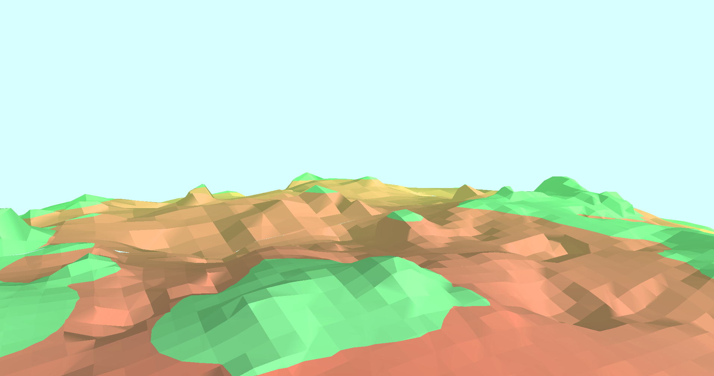
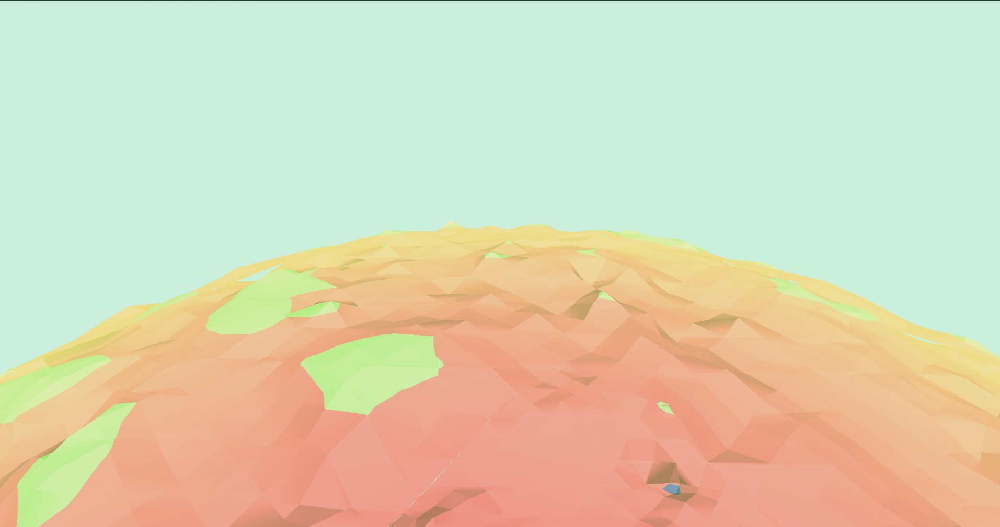

# What is New Horizon?

New Horizon is the working title for an OpenGL powered voxel engine that triangulates a 3-dimensional scalar field to form a terrain.

The data points for the scalar field are calculated by an arbitrary function of choice to represent the desired shape. The scalar field is then used by a marching cube algorithm to generate the needed triangles.

The main challenge that an implementation like this faces is computation speed.
New Horizon makes use of multiple constructs and ideas to speed this process up to achieve realtime (practical) infinite terrain for the user to explore.
The main performance increase comes from utilizing the GPU to calculate most of the terrain data efficiently.

The engine uses an octree implementation along with some other methods inorder to be able to display big scalar fields in a memory efficient way and still allow for an arbitrary high resolution of the mesh.

## What can I do with this?

The master branch of this repository contains a working example of the engine.
Clone the repository and use the following maven command to build a .jar file.

    mvn clean install

This allows you to check out a demo planet and see the engine in work.

### Open Simplex Noise

The Noise method used for terrain generation is based on example code by Stefan Gustavson (stegu@itn.liu.se).
Optimisations by Peter Eastman (peastman@drizzle.stanford.edu).
Better rank ordering method by Stefan Gustavson in 2012.

